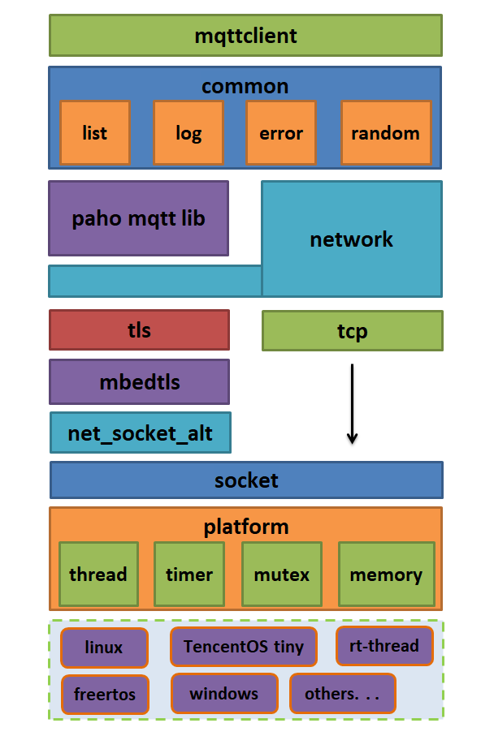

[](https://github.com/jiejieTop/mqttclient/releases)
[](https://github.com/jiejieTop/mqttclient/blob/master/LICENSE)


[中文说明](README_CN.md)

# mqttclient

**A high-performance, high-stability, cross-platform MQTT client**

A high-performance, high-stability, cross-platform MQTT client, developed based on the socket API, can be used on embedded devices (FreeRTOS / LiteOS / RT-Thread / TencentOS tiny), Linux, Windows, Mac, with a very concise The API interface realizes the quality of service of QOS2 with very few resources, and seamlessly connects the mbedtls encryption library.

## Advantage:

- **Developed based on standard BSD socket**, as long as it is compatible with BSD socket system.

- **Stable**: Whether it is`reconnecting offline` or` retransmitting lost packets`, it is strictly performed according to the MQTT protocol standard. Besides, the test of**large data amount**is Sending and receiving are very stable (send`135K` data at a time, once every 3 seconds), and the high-frequency test is also very stable (seven topics are sent and received at once, once per second, which is 14 mqtt messages per second, and the quality of service (QoS0, QoS1, QoS2 all). Because the author designed the`recording mechanism` with very few resources, it must ensure that the packets using QoS1 quality of service arrive once. When the published topic (both qos1 and qos2) is not received by the server, it will be automatically resent. The QoS2 quality of service packet is guaranteed to be processed only once. (If you do not believe in its stability, you can modify the source code to test the QoS2 quality of service. You will not reply the`PUBREC` packet, and let the server resend QoS2. Message, and see if the client has processed it only once), and for the stability of disconnection and reconnection, this is the**basic operation**, nothing to say, it will still be after automatic reconnection Automatically re-subscribe topics to ensure that topics are not lost, so it is very stable in testing.

- **Lightweight**: The entire code project is extremely simple. It uses very few resources without using mbedtls. The author used the esp8266 module to communicate with the cloud. The entire project code consumes less than 15k of RAM (including system overhead). , The data processing overhead, and this time is still not optimized, the stability of the disconnection and reconnection is still perfectly preserved, but the messages corresponding to the quality of service of qos1 and qos2 have not been tested because the STM32F103C8T6 chip resources are really It is too little to toss).

- **Seamless connection with mbedtls encrypted transmission**, making network transmission more secure, and the interface layer does not need the user to care at all. Regardless of whether it is encrypted or not, the API interface provided by mqttclient is**there is no change**, which is very Good compatible with a set of codes of the generation application layer can be transmitted encrypted or not encrypted.

- **With minimal API interface**, in general, mqttclient's configuration has default values, which can be used basically without configuration, and can be configured at will, and has robustness detection for configuration. The API interface is also very simple.

- **Has very good code style and ideas**: The entire code adopts a layered design, and the code implementation adopts the idea of ​​asynchronous processing to reduce coupling and improve performance. Where is it reflected? It's very simple. Currently, many MQTT clients in the market publish topics to block and wait for acks. This is a very violent behavior, blocking the current thread waiting for a response from the server. What if I want to send data or I need to repeatedly check the data? What to do, you might say, specify the blocking time to wait, then if the network is delayed and ack is not late, will I wait in vain, what about the service quality of qos1, qos2, so this kind of processing is still asynchronous Thought, I publish the topic, then I just publish it, there is no need to wait, for the MQTT messages of qos1, qos2 quality of service, if the server does not receive, then I can resend, this resend is also asynchronous processing, Does not block the current thread at all.

- **MQTT protocol supports subject wildcards " # "," + " .**

- **Subscribed topics are completely separated from message processing**, making programming logic easier to use, users don't need to worry about complicated logical relationships.

- **The keepalive processing mechanism has been implemented inside mqttclient**, so users don't need to care too much about it. Users only need to concentrate on processing application functions.

- **Seamless salof**: It is a synchronous and asynchronous log output framework, which outputs the corresponding log information during idle time. It can also write the information to flash and save it for debugging.

- **No external dependence.**

- **Use paho mqtt library**

## Overall framework

Has a very clear layered framework.



**Linux, TencentOS tiny, FreeRTOS, and RT-Thread platforms have been implemented (packages have been made and named `kawaii-mqtt` ). In addition, TencentOS tiny's AT framework can also be used (RAM consumption is less than 15K). And the stability is excellent!**


| Platform       | Code Location |
| -------------- | ------------- |
| Linux          | [https://github.com/jiejieTop/mqttclient](https://github.com/jiejieTop/mqttclient) |
| TencentOS tiny | [https://github.com/Tencent/TencentOS-tiny/tree/master/board/Fire_STM32F429](https://github.com/Tencent/TencentOS-tiny/tree/master/board/Fire_STM32F429) |
| TencentOS tiny AT framework | [https://github.com/jiejieTop/gokit3-board-mqttclient](https://github.com/jiejieTop/gokit3-board-mqttclient) |
| RT-Thread      | [https://github.com/jiejieTop/kawaii-mqtt](https://github.com/jiejieTop/kawaii-mqtt) |
| FreeRTOS       | [https://github.com/jiejieTop/freertos-mqttclient](https://github.com/jiejieTop/freertos-mqttclient) |

## Version

Release version | Description |
| --- | --- |
| [v1.0.0] | Initial release, verification of basic concepts and stability |
| [v1.0.1] | Fix logic when actively disconnecting from the server |
| [v1.0.2] | Add a new feature-interceptor, fix some minor bugs |
| [v1.0.3] | To avoid global pollution, modify the naming of log and list related functions |

## Question

Welcome to submit issues and bug reports in the form of [GitHub Issues](https://github.com/jiejieTop/mqttclient/issues)

## Copyright and license

mqttclient is provided by [Apache License v2.0](https://github.com/jiejieTop/mqttclient/blob/master/LICENSE).

Briefly describe the description of the open source protocol. [Apache License v2.0](https://github.com/jiejieTop/mqttclient/blob/master/LICENSE) Encourage code sharing and respect the copyright of the original author, which can be used freely. Modify the source code, and you can also distribute the modified code as open source or proprietary software (as open source or closed source commercial software),**but the source code must retain the author's copyright statement**.

## Test and use under linux platform
### Install cmake:
```bash
sudo apt-get install cmake
```

### Configuration
Modify the following in the`mqttclient/test/test.c` file:
```c
    init_params.connect_params.network_params.network_ssl_params.ca_crt = test_ca_get (); /*CA certificate*/
    init_params.connect_params.network_params.addr = "xxxxxxx"; /*server domain name*/
    init_params.connect_params.network_params.port = "8883"; /*server port number*/
    init_params.connect_params.user_name = "xxxxxxx"; /*username*/
    init_params.connect_params.password = "xxxxxxx"; /*password*/
    init_params.connect_params.client_id = "xxxxxxx"; /*client id*/
```

### mbedtls

Mbedtls is turned on by default.

[salof](https://github.com/jiejieTop/salof) The full name is:`Synchronous Asynchronous Log Output Framework` (Synchronous Asynchronous Log Output Framework), which is a synchronous asynchronous log output framework, which outputs the corresponding log when idle Information, and the library seamlessly interfaces with mqttclient.

**Configure the corresponding log output level:**

```c
#define BASE_LEVEL (0)
#define ASSERT_LEVEL (BASE_LEVEL + 1) /*Log output level: assertion level (very high priority)*/
#define ERR_LEVEL (ASSERT_LEVEL + 1) /*Log output level: error level (high priority)*/
#define WARN_LEVEL (ERR_LEVEL + 1) /*Log output level: warning level (medium priority)*/
#define INFO_LEVEL (WARN_LEVEL + 1) /*Log output level: Information level (low priority)*/
#define DEBUG_LEVEL (INFO_LEVEL + 1) /*Log output level: debug level (lower priority)*/

#define LOG_LEVEL WARN_LEVEL /*Log output level*/
```

**Other log options:**

-Terminal with color
-Timestamp
-Tags

### Configuration of mqttclient

Configure the maximum value of the mqtt waiting list. You can set a larger value for qos1 and qos2 service quality. Of course, you must keep up with the resources. It is mainly to ensure that the mqtt packets of qos1 and qos2 can reach the server accurately.

```c
#define MQTT_ACK_HANDLER_NUM_MAX 64
```

Select the version of the MQTT protocol. The default value is 4, which means that MQTT 3.1.1 is used, and 3 means MQTT 3.1.

```c
#define MQTT_VERSION 4 // 4 is mqtt 3.1.1
```

Set the default keep-alive time, which is mainly to ensure that the MQTT client and the server maintain an active connection, in seconds. For example, the MQTT client and the server 100S have not sent data and have not received data. At this time, the MQTT client will send A ping packet confirms whether the session exists. If a response from the server is received, it indicates that the session still exists and data can be sent and received at any time. If it does not exist, the session is cleared.

```c
#define MQTT_KEEP_ALIVE_INTERVAL 100 // unit: second
```

The default command timeout, which is mainly used for socket read and write timeouts, can be specified during MQTT initialization:

```
#define MQTT_DEFAULT_CMD_TIMEOUT 4000
```

The length of the default topic. The topic supports wildcard characters. If the topic is too long, it will be truncated:

```c
#define MQTT_TOPIC_LEN_MAX 64
```

The size of the default algorithm data buffer. If you want to send a large amount of data, modify it. You can specify it during MQTT initialization:

```c
#define MQTT_DEFAULT_BUF_SIZE 1024
```

Thread-related configuration, such as thread stack, thread priority, thread time slice, etc .:
In the Linux environment, you don't need to worry about these parameters, but in the RTOS platform, you need to configure. If you do not use mbedtls, the 2048 bytes of the thread stack is sufficient. After using mbedtls encryption, you need to configure more than 4096 bytes.
```c
#define MQTT_THREAD_STACK_SIZE 2048 // Thread stack
#define MQTT_THREAD_PRIO 5 // Thread priority
#define MQTT_THREAD_TICK 50 // Thread time slice
```

The default reconnection interval. When a disconnection occurs, reconnection will be attempted at this interval:
```c
#define MQTT_RECONNECT_DEFAULT_DURATION 1000
```

Other things that don't need to be configured:
```c
#define MQTT_MAX_PACKET_ID (0xFFFF-1) // mqtt message id
#define MQTT_MAX_CMD_TIMEOUT 20000 // Maximum command timeout parameter
#define MQTT_MIN_CMD_TIMEOUT 1000 // Minimum command timeout parameter
```

> ps: The above parameters basically do not need to be configured, just use it ~

### Compile & Run
```bash
./build.sh
```
After running the`build.sh` script, the executable file` mqtt-client` will be generated in the`./Build/bin/` directory, and you can run it directly.

### Compile into a dynamic library libmqttclient.so

`` `bash
./make-libmqttclient.sh
`` `

After running the `make-libmqttclient.sh` script, a dynamic library file` libmqttclient.so` will be generated in the `. / Libmqttclient / lib` directory and installed into the system ’s` / usr / lib` directory, the relevant header files have Copy to the `. / Libmqttclient / include` directory, when compiling the application, you only need to link the dynamic library` -lmqttclient`, the configuration file of the dynamic library is configured according to `. / Test / mqtt_config.h`


## Design thinking
-The overall design is layered, and the code is implemented asynchronously to reduce coupling.
-Message processing is handled by callback: user specifies`[subscribed topic]` and specified`[message processing function]`
-No external dependence

## API
`mqttclient` has a very simple` api` interface
```c
int mqtt_keep_alive(mqtt_client_t* c);
int mqtt_init(mqtt_client_t* c, client_init_params_t* init);
int mqtt_release(mqtt_client_t* c);
int mqtt_connect(mqtt_client_t* c);
int mqtt_disconnect(mqtt_client_t* c);
int mqtt_subscribe(mqtt_client_t* c, const char* topic_filter, mqtt_qos_t qos, message_handler_t msg_handler);
int mqtt_unsubscribe(mqtt_client_t* c, const char* topic_filter);
int mqtt_publish(mqtt_client_t* c, const char* topic_filter, mqtt_message_t* msg);
int mqtt_list_subscribe_topic(mqtt_client_t* c);
int mqtt_set_interceptor_handler(mqtt_client_t* c, interceptor_handler_t handler);
```

## Core

**mqtt_client_t structure**

```c
typedef struct mqtt_client {
    unsigned short              packet_id;
    unsigned char               ping_outstanding;
    unsigned char               ack_handler_number;
    unsigned char               *read_buf;
    unsigned char               *write_buf;
    unsigned int                cmd_timeout;
    unsigned int                read_buf_size;
    unsigned int                write_buf_size;
    unsigned int                reconnect_try_duration;
    void                        *reconnect_date;
    reconnect_handler_t         reconnect_handler;
    client_state_t              client_state;
    platform_mutex_t            write_lock;
    platform_mutex_t            global_lock;
    mqtt_list_t                 msg_handler_list;
    mqtt_list_t                 ack_handler_list;
    network_t                   *network;
    platform_thread_t           *thread;
    platform_timer_t            reconnect_timer;
    platform_timer_t            last_sent;
    platform_timer_t            last_received;
    connect_params_t            *connect_params;
    interceptor_handler_t       interceptor_handler;
} mqtt_client_t;
```

This structure mainly maintains the following:
1. Read and write data buffers`read_buf, write_buf`
2. Command timeout`cmd_timeout` (mainly read and write blocking time, waiting time for response, reconnection waiting time)
3. Maintain the`ack` linked list` ack_handler_list`, which is the core of asynchronous implementation, and all the messages waiting for response will be mounted on this linked list
4. Maintain the message processing list`msg_handler_list`, which is the content that the` mqtt` protocol must implement. All`publish` messages from the server will be processed (provided that the corresponding messages are subscribed)
5. Maintain a network card interface`network`
6. Maintain an internal thread`thread`, all mqtt packages from the server will be processed here!
7. Two timers, namely the reconnect timer and keep-alive timer`reconnect_timer, last_sent, last_received`
8. Some connection parameters`connect_params`


## mqttclient implementation

The following is the implementation of the entire framework, so that everyone can more easily understand the mqttclient code and design ideas, so that everyone can modify the source code and use, you can also submit pr or issues, the open source world looks forward to your participation, thank you!

In addition, the`recording mechanism` of the following code and its` timeout processing mechanism` are very good programming ideas. If you are interested, you must look at the source code!

### Initialization

```c
int mqtt_init (mqtt_client_t*c, client_init_params_t*init)
```

It mainly configures the relevant information of the`mqtt_client_t` structure. If no initialization parameters are specified, the system will provide default parameters.
But the parameters of the connection part must be specified:

```c
    init_params.connect_params.network_params.addr = "[your mqtt server IP address or domain name]";
    init_params.connect_params.network_params.port = 1883; // Port number
    init_params.connect_params.user_name = "jiejietop";
    init_params.connect_params.password = "123456";
    init_params.connect_params.client_id = "clientid";

    mqtt_init (& client, & init_params);
```

### connect to the server

```c
int mqtt_connect (mqtt_client_t*c);
```

The parameters are only pointers of type`mqtt_client_t`,` topic` of string type (support wildcard "#" "+"),`quality of service` of topic, and` handling function` of received message, if not specified, there is The default processing function. The connection to the server is designed in a non-asynchronous manner, because you must wait for the connection to the server before proceeding.

The process is as follows:
1. Call the underlying connection function to connect to the server:

```c
c-> network-> connect (c-> network);
```

2. Serialize the`CONNECT` message of` mqtt` and send

```c
MQTTSerialize_connect (c-> write_buf, c-> write_buf_size, & connect_data)
mqtt_send_packet (c, len, & connect_timer)
```

3. Wait for the`CONNACK` message from the server

```c
mqtt_wait_packet (c, CONNACK, & connect_timer)
```

4. After successful connection, create an internal thread`mqtt_yield_thread` and start it at the appropriate time:

```c
platform_thread_init ("mqtt_yield_thread", mqtt_yield_thread, c, MQTT_THREAD_STACK_SIZE, MQTT_THREAD_PRIO, MQTT_THREAD_TICK)

if (NULL! = c-> thread) {
    mqtt_set_client_state (c, CLIENT_STATE_CONNECTED);
    platform_thread_startup (c-> thread);
    platform_thread_start (c-> thread); /*start run mqtt thread*/
}
```

5. For reconnection, it will not re-create the thread, just change the client state to the connection state:

```c
mqtt_set_client_state (c, CLIENT_STATE_CONNECTED);
```

### Subscribe to messages

```c
int mqtt_subscribe (mqtt_client_t*c, const char*topic_filter, mqtt_qos_t qos, message_handler_t handler)
```

The subscription message is implemented using an asynchronous design:
The process is as follows:
1. Serialize the subscription message and send it to the server

```c
MQTTSerialize_subscribe (c-> write_buf, c-> write_buf_size, 0, mqtt_get_next_packet_id (c), 1, & topic, (int*) & qos)
mqtt_send_packet (c, len, & timer)
```

2. Create a corresponding message processing node. This message node will be mounted on the message processing list`msg_handler_list` after receiving the server's` SUBACK` subscription response message.

```c
mqtt_msg_handler_create (topic_filter, qos, handler)
```

3. After sending a message to the server, you have to wait for the response from the server, first record this wait for`SUBACK`

```c
mqtt_ack_list_record (c, SUBACK, mqtt_get_next_packet_id (c), len, msg_handler)
```

### unsubscribe
It is basically similar to the logic of subscribing to the message ~

1. Serialize the subscription message and send it to the server

```c
MQTTSerialize_unsubscribe (c-> write_buf, c-> write_buf_size, 0, packet_id, 1, & topic)
mqtt_send_packet (c, len, & timer)
```

2. Create a corresponding message processing node. This message node destroys the subscribed topic message nodes on the message processing list`msg_handler_list` after receiving the server's` UNSUBACK` unsubscribe response message.

```c
mqtt_msg_handler_create ((const char*) topic_filter, QOS0, NULL)
```

3. After sending a message to the server, you have to wait for the response from the server, first record this wait for`UNSUBACK`

```c
mqtt_ack_list_record (c, UNSUBACK, packet_id, len, msg_handler)
```

### Post message

```c
int mqtt_publish (mqtt_client_t*c, const char*topic_filter, mqtt_message_t*msg)
```

The parameters are only pointers of type`mqtt_client_t`,` topics` of string type (supporting wildcards), and messages to be published (including`quality of service`,` message body`).

```c
    mqtt_message_t msg;
    
    msg.qos = 2;
    msg.payload = (void*) buf;
    
mqtt_publish (& client, "testtopic1", & msg);
```

The core ideas are similar, and the process is as follows:
1. Serialize the release message first, and then send it to the server

```c
MQTTSerialize_publish (c-> write_buf, c-> write_buf_size, 0, msg-> qos, msg-> retained, msg-> id,
              topic, (unsigned char*) msg-> payload, msg-> payloadlen);
mqtt_send_packet (c, len, & timer)
```

2. For QOS0 logic, do nothing, and for QOS1 and QOS2 messages need to be recorded and retransmitted when no response from the server is received.

```c
    if (QOS1 == msg-> qos) {
        rc = mqtt_ack_list_record (c, PUBACK, mqtt_get_next_packet_id (c), len, NULL);
    } else if (QOS2 == msg-> qos) {
        rc = mqtt_ack_list_record (c, PUBREC, mqtt_get_next_packet_id (c), len, NULL);
    }
```

3. There is also a very important point. The DUP flag bit needs to be set in the MQTT message header of the retransmission message. This is the standard of the MQTT protocol. Therefore, the author directly manipulated the DUP flag bit of the message during retransmission. Because the function to modify the DUP flag is not found in the MQTT library, I have encapsulated a function. This is the same as the idea of ​​cross access in LwIP. It assumes that I know all the operations of the MQTT message, so I can operate It, this way can improve a lot of efficiency:

```c
mqtt_set_publish_dup (c, 1); /*may resend this data, set the udp flag in advance*/
```

### Internal threads

```c
static void mqtt_yield_thread (void*arg)
```

It mainly deals with the return value of the`mqtt_yield` function, such as destroying this thread when` disconnect`.

### Core processing functions

1. Packet processing`mqtt_packet_handle`

```c
static int mqtt_packet_handle (mqtt_client_t*c, platform_timer_t*timer)
```

Use different processing for different packages:

```c
    switch (packet_type) {
        case 0: /*timed out reading packet*/
            break;

        case CONNACK:
            break;

        case PUBACK:
        case PUBCOMP:
            rc = mqtt_puback_and_pubcomp_packet_handle (c, timer);
            break;

        case SUBACK:
            rc = mqtt_suback_packet_handle (c, timer);
            break;
            
        case UNSUBACK:
            rc = mqtt_unsuback_packet_handle (c, timer);
            break;

        case PUBLISH:
            rc = mqtt_publish_packet_handle (c, timer);
            break;

        case PUBREC:
        case PUBREL:
            rc = mqtt_pubrec_and_pubrel_packet_handle (c, timer);
            break;

        case PINGRESP:
            c-> ping_outstanding = 0;
            break;

        default:
            goto exit;
    }
```

And do keepalive processing:

```c
mqtt_keep_alive (c)
```

When a timeout occurs

```c
if (platform_timer_is_expired (& c-> last_sent) || platform_timer_is_expired (& c-> last_received))
```

Sequence number a heartbeat packet and send it to the server

```c
MQTTSerialize_pingreq (c-> write_buf, c-> write_buf_size);
mqtt_send_packet (c, len, & timer);
```

When the timeout occurs again, it indicates that the connection to the server has been disconnected and a reconnection operation is required. Set the client status to disconnected.

```c
mqtt_set_client_state (c, CLIENT_STATE_DISCONNECTED);
```

2. Scan the ack list. When receiving a message from the server, scan the ack list.

```c
mqtt_ack_list_scan (c);
```

When the timeout expires, destroy the ack list node:

```c
mqtt_ack_handler_destroy (ack_handler);
```

Of course, the following types of packets need to be retransmitted: (`PUBACK, PUBREC, PUBREL, PUBCOMP` to ensure the quality of service of QOS1 and QOS2)

```c
if ((ack_handler-> type == PUBACK) || (ack_handler-> type == PUBREC) || (ack_handler-> type == PUBREL) || (ack_handler-> type == PUBCOMP))
mqtt_ack_handler_resend (c, ack_handler);
```

3. The time to keep active has passed, it may be offline, and you need to reconnect.

```c
mqtt_try_reconnect (c);
```

After reconnecting successfully, try to resubscribe the message to ensure the original state is restored ~

```c
mqtt_try_resubscribe (c)
```

### Processing of release response and release completion messages

```c
static int mqtt_puback_and_pubcomp_packet_handle (mqtt_client_t*c, platform_timer_t*timer)
```

Deserialized message

```c
MQTTDeserialize_ack (& ​​packet_type, & dup, & packet_id, c-> read_buf, c-> read_buf_size)
```

2. Cancel the corresponding ack record

```c
mqtt_ack_list_unrecord (c, packet_type, packet_id, NULL);
```

### Processing of subscription response messages

```c
static int mqtt_suback_packet_handle (mqtt_client_t*c, platform_timer_t*timer)
```

Deserialized message

```c
MQTTDeserialize_suback (& ​​packet_id, 1, & count, (int*) & granted_qos, c-> read_buf, c-> read_buf_size)
```

2. Cancel the corresponding ack record

```c
mqtt_ack_list_unrecord (c, packet_type, packet_id, NULL);
```

3. Install the corresponding subscription message processing function, if it already exists, it will not be installed

```c
mqtt_msg_handlers_install (c, msg_handler);
```

### Processing of unsubscribe response message

```c
static int mqtt_unsuback_packet_handle (mqtt_client_t*c, platform_timer_t*timer)
```

Deserialized message

```c
MQTTDeserialize_unsuback (& ​​packet_id, c-> read_buf, c-> read_buf_size)
```

2. Cancel the corresponding ack record and obtain the message processing node that has been subscribed

```c
mqtt_ack_list_unrecord (c, UNSUBACK, packet_id, & msg_handler)
```

3. Destroy the corresponding subscription message processing function

```c
mqtt_msg_handler_destory (msg_handler);
```

### Processing of published messages from the server

```c
static int mqtt_publish_packet_handle (mqtt_client_t*c, platform_timer_t*timer)
```

Deserialized message

```c
MQTTDeserialize_publish (& msg.dup, & qos, & msg.retained, & msg.id, & topic_name,
        (unsigned char**) & msg.payload, (int*) & msg.payloadlen, c-> read_buf, c-> read_buf_size)
```

2. For QOS0 and QOS1 packets, directly process the messages

```c
mqtt_deliver_message (c, & topic_name, & msg);
```

3. For QOS1 messages, you also need to send a`PUBACK` response message to the server

```c
MQTTSerialize_ack (c-> write_buf, c-> write_buf_size, PUBACK, 0, msg.id);
```

4. For QOS2 messages, you need to send a`PUBREC` message to the server. In addition, you need to record` PUBREL` to the ack list, wait for the server to release the release message, and finally process the message.

```c
MQTTSerialize_ack (c-> write_buf, c-> write_buf_size, PUBREC, 0, msg.id);
mqtt_ack_list_record (c, PUBREL, msg.id + 1, len, NULL)
mqtt_deliver_message (c, & topic_name, & msg);
```

> Note: Once a message is registered on the ack list, it will not be re-registered when there is a duplicate message. It will use the`mqtt_ack_list_node_is_exist` function to determine whether this node exists. It mainly depends on the message type and msgid waiting for a response .

### Processing of Release Receive and Release Release Messages

```c
static int mqtt_pubrec_and_pubrel_packet_handle (mqtt_client_t*c, platform_timer_t*timer)
```

Deserialized message

```c
MQTTDeserialize_ack (& ​​packet_type, & dup, & packet_id, c-> read_buf, c-> read_buf_size)
```

2. Generate a corresponding response message

```c
mqtt_publish_ack_packet (c, packet_id, packet_type);
```

3. Cancel the corresponding ack record

```c
mqtt_ack_list_unrecord (c, UNSUBACK, packet_id, & msg_handler)
```